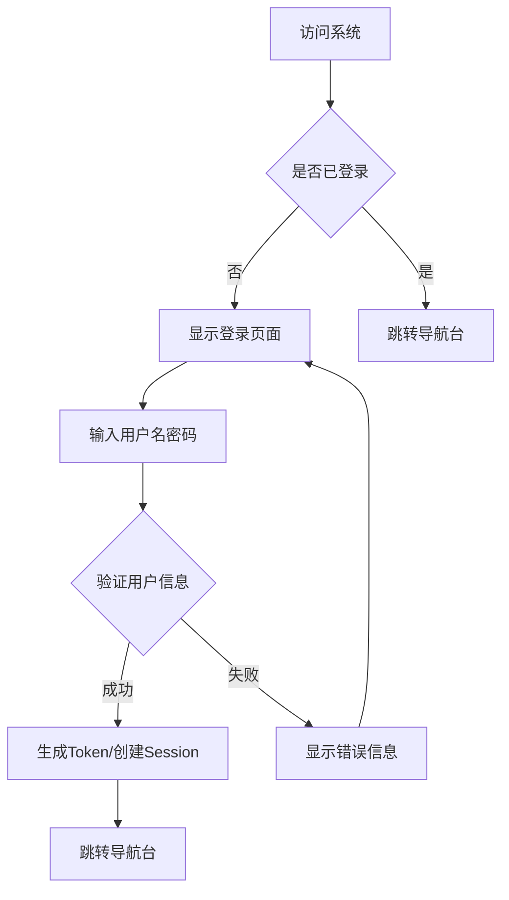
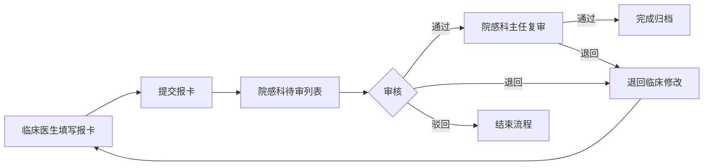
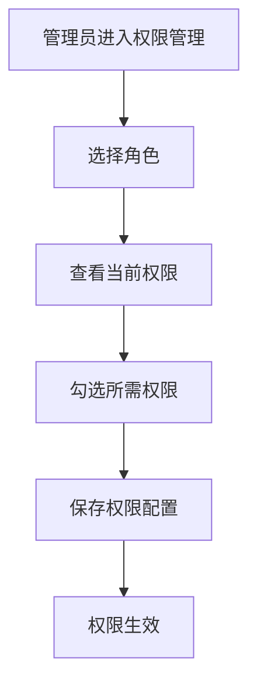

# 医院感染控制系统 - 产品需求文档

## 1. 产品概述

医院感染控制系统（Hospital Infection Control System，HICS）是一款面向医疗机构感染管理部门的专业化信息系统，旨在实现医院感染病例的在线报告、审核、追踪与管理，提高感染控制工作效率，保障医疗安全。

### 主要目的
- 实现院感病例的电子化、规范化管理
- 优化院感报告审核流程，提高工作效率
- 实时监控感染数据，支持决策分析
- 保障患者安全，降低院感发生率

### 目标用户
- 医院感染管理部门专职人员
- 临床科室医务人员
- 医院管理层决策人员
- 系统管理员

---

## 2. 核心功能

### 2.1 用户角色

| 角色 | 描述 | 核心权限 |
|------|------|----------|
| 系统管理员 | 负责系统配置、用户管理、权限分配 | 系统配置、用户管理、权限管理、全功能访问 |
| 院感科主任 | 负责院感报卡审核、统计报表 | 报卡审核、数据统计、报表导出 |
| 院感专职人员 | 负责报卡录入、数据分析 | 报卡录入、修改、查询、统计 |
| 临床医生 | 负责本科室院感报卡填写 | 本科室报卡填写、查询 |
| 护士长 | 负责科室报卡初步审核 | 科室报卡审核、查询 |

### 2.2 功能模块

1. **登录模块**：用户登录、退出、密码找回
2. **导航台模块**：数据概览、待办事项、快捷入口、统计图表
3. **用户管理模块**：用户列表、新增用户、编辑用户、删除用户、批量操作
4. **权限管理模块**：角色定义、权限分配、权限组管理
5. **院感报卡模块**：报卡录入、报卡列表、报卡详情、审核功能、时间轴展示

### 2.3 页面详情

| 页面名称 | 模块名称 | 功能描述 |
|----------|----------|----------|
| 登录页面 | 登录表单 | 用户名/密码输入、登录按钮、记住登录状态 |
| 导航台 | 数据概览卡片 | 显示今日报卡数、待审核数、本月累计等关键指标 |
| 导航台 | 待办事项列表 | 展示待审核报卡列表，支持快速操作 |
| 导航台 | 统计图表 | 近7天报卡趋势图、感染类型分布图 |
| 用户管理 | 用户列表 | 用户表格展示、分页、搜索、筛选 |
| 用户管理 | 用户表单 | 新增/编辑用户信息表单 |
| 权限管理 | 角色列表 | 角色表格展示、新增/编辑/删除角色 |
| 权限管理 | 权限配置 | 树形权限选择、角色权限分配 |
| 院感报卡 | 报卡表单 | 感染病例信息录入表单，包含患者信息、诊断信息等 |
| 院感报卡 | 报卡列表 | 报卡表格展示、状态筛选、搜索 |
| 院感报卡 | 报卡详情 | 完整报卡信息展示、操作按钮 |
| 院感报卡 | 审核面板 | 审核意见输入、审核状态选择 |
| 院感报卡 | 时间轴 | 报卡全生命周期状态变更记录 |

---

## 3. 核心流程

### 3.1 用户登录流程

### 3.2 院感报卡流程

### 3.3 权限管理流程

---

## 4. 用户界面设计

### 4.1 设计风格

**设计理念**：专业、可信赖、高效

- **主色调**：深蓝色（#1E40AF）传递专业与信任感
- **辅助色**：青色（#0891B2）代表医疗健康
- **警示色**：红色（#DC2626）用于重要提示和待处理事项
- **成功色**：绿色（#059669）用于已完成状态
- **背景色**：浅灰（#F8FAFC）提供舒适的视觉体验
- **文字色**：深灰（#1E293B）确保良好的可读性

**字体选择**：
- 标题：思源黑体（Noto Sans SC）或系统默认无衬线字体
- 正文：思源黑体（Noto Sans SC）
- 数据/数字：等宽字体用于表格数据

**按钮样式**：
- 主要操作：实心蓝色按钮
- 次要操作：边框按钮
- 危险操作：红色按钮
- 圆角：4px
- 悬停效果：轻微阴影提升

**布局风格**：
- 侧边导航布局
- 顶部固定导航栏
- 内容区采用卡片式设计
- 表格采用斑马纹设计
- 响应式布局适配不同屏幕

**图标风格**：
- 使用线性图标
- 一致的线条粗细
- 与整体设计风格统一

### 4.2 页面设计概览

| 页面名称 | 主要元素 | 视觉风格 |
|----------|----------|----------|
| 登录页面 | 居中卡片、品牌Logo、背景渐变 | 简洁大气、专业信任 |
| 导航台 | 指标卡片、图表、待办列表 | 数据可视化、重点突出 |
| 用户管理 | 数据表格、筛选器、操作按钮 | 清晰高效、易于操作 |
| 权限管理 | 树形结构、角色卡片 | 结构清晰、层次分明 |
| 院感报卡 | 表单、详情卡片、时间轴 | 信息完整、流程清晰 |

### 4.3 响应式设计

- 采用桌面端优先设计
- 平板适配：侧边栏可折叠
- 移动端适配：底部导航、主要功能快捷入口

---

## 5. 数据安全要求

- 用户密码采用加密存储（SHA-256 + salt）
- 敏感操作需记录操作日志
- Session/Token 有效期管理
- 操作权限严格控制
- 数据传输采用 HTTPS 加密
