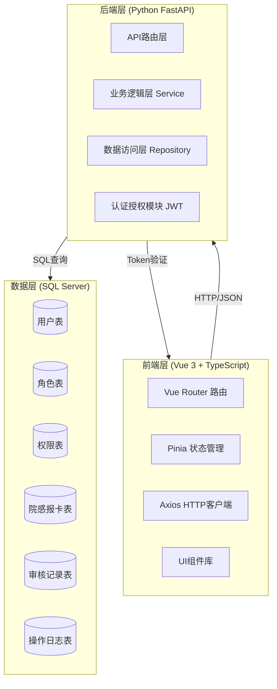
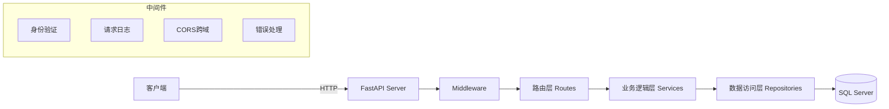
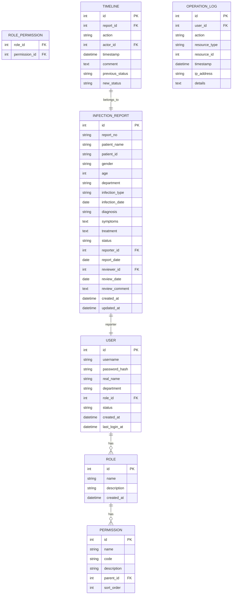

# 医院感染控制系统 - 技术架构文档

## 1. 架构设计



## 2. 技术选型

### 2.1 前端技术栈

| 技术 | 版本 | 用途 |
|------|------|------|
| Vue | 3.4+ | 渐进式JavaScript框架 |
| TypeScript | 5.3+ | 类型安全开发 |
| Vite | 5.0+ | 构建工具和开发服务器 |
| Vue Router | 4.2+ | 前端路由管理 |
| Pinia | 2.1+ | 状态管理 |
| Axios | 1.6+ | HTTP客户端 |
| Element Plus | 2.5+ | UI组件库 |
| ECharts | 5.5+ | 数据可视化图表 |
| dayjs | 1.11+ | 日期时间处理 |

### 2.2 后端技术栈

| 技术 | 版本 | 用途 |
|------|------|------|
| Python | 3.11+ | 编程语言 |
| FastAPI | 0.109+ | 高性能Web框架 |
| SQLAlchemy | 2.0+ | ORM框架 |
| PyJWT | 2.8+ | JWT令牌处理 |
| Passlib | 1.7+ | 密码加密 |
| pymssql | 2.2+ | SQL Server驱动 |
| Pydantic | 2.5+ | 数据验证 |

### 2.3 数据库

| 技术 | 版本 | 用途 |
|------|------|------|
| SQL Server | 2019+ | 关系型数据库 |
| SQL Server Management Studio | - | 数据库管理工具 |

## 3. 路由定义

### 3.1 前端路由

| 路由路径 | 页面组件 | 权限要求 |
|----------|----------|----------|
| /login | 登录页面 | 公开 |
| /dashboard | 导航台 | 已登录 |
| /user-management | 用户管理 | 系统管理员 |
| /permission-management | 权限管理 | 系统管理员 |
| /infection-report | 院感报卡列表 | 已登录 |
| /infection-report/new | 新增报卡 | 已登录 |
| /infection-report/:id | 报卡详情 | 已登录 |
| /infection-report/:id/edit | 编辑报卡 | 已登录 |

### 3.2 后端API

| 接口路径 | 方法 | 描述 | 权限 |
|----------|------|------|------|
| /api/auth/login | POST | 用户登录 | 公开 |
| /api/auth/logout | POST | 用户登出 | 已登录 |
| /api/auth/current-user | GET | 获取当前用户 | 已登录 |
| /api/users | GET | 获取用户列表 | 管理员 |
| /api/users | POST | 创建用户 | 管理员 |
| /api/users/:id | GET | 获取用户详情 | 管理员 |
| /api/users/:id | PUT | 更新用户 | 管理员 |
| /api/users/:id | DELETE | 删除用户 | 管理员 |
| /api/roles | GET | 获取角色列表 | 管理员 |
| /api/roles | POST | 创建角色 | 管理员 |
| /api/roles/:id | PUT | 更新角色 | 管理员 |
| /api/roles/:id | DELETE | 删除角色 | 管理员 |
| /api/permissions | GET | 获取权限列表 | 管理员 |
| /api/permissions | POST | 创建权限 | 管理员 |
| /api/dashboard/stats | GET | 获取统计数据 | 已登录 |
| /api/infection-reports | GET | 获取报卡列表 | 已登录 |
| /api/infection-reports | POST | 创建报卡 | 已登录 |
| /api/infection-reports/:id | GET | 获取报卡详情 | 已登录 |
| /api/infection-reports/:id | PUT | 更新报卡 | 已登录 |
| /api/infection-reports/:id | DELETE | 删除报卡 | 已登录 |
| /api/infection-reports/:id/approve | POST | 审核通过 | 审核权限 |
| /api/infection-reports/:id/reject | POST | 退回报卡 | 审核权限 |
| /api/infection-reports/:id/timeline | GET | 获取时间轴 | 已登录 |

## 4. API 数据结构

### 4.1 登录请求/响应

```typescript
// 登录请求
interface LoginRequest {
  username: string;
  password: string;
}

// 登录响应
interface LoginResponse {
  token: string;
  user: {
    id: number;
    username: string;
    realName: string;
    role: string;
    permissions: string[];
  };
}
```

### 4.2 用户数据结构

```typescript
// 用户信息
interface User {
  id: number;
  username: string;
  realName: string;
  department: string;
  role: string;
  status: 'active' | 'inactive';
  createdAt: string;
  lastLoginAt: string;
}

// 用户表单
interface UserForm {
  username: string;
  password?: string;
  realName: string;
  department: string;
  roleId: number;
}
```

### 4.3 院感报卡数据结构

```typescript
// 报卡信息
interface InfectionReport {
  id: number;
  reportNo: string;  // 报卡编号
  patientName: string;
  patientId: string;
  gender: 'male' | 'female';
  age: number;
  department: string;
  infectionType: string;
  infectionDate: string;
  diagnosis: string;
  symptoms: string;
  treatment: string;
  status: 'draft' | 'pending' | 'approved' | 'rejected' | 'returned';
  reporter: string;
  reportDate: string;
  reviewer?: string;
  reviewDate?: string;
  reviewComment?: string;
  createdAt: string;
  updatedAt: string;
}

// 时间轴节点
interface TimelineNode {
  id: number;
  reportId: number;
  action: string;
  actor: string;
  timestamp: string;
  comment?: string;
  previousStatus: string;
  newStatus: string;
}
```

### 4.4 统计数据

```typescript
// 仪表盘统计数据
interface DashboardStats {
  todayReports: number;
  pendingReviews: number;
  monthlyTotal: number;
  approvedRate: number;
  weeklyTrend: Array<{
    date: string;
    count: number;
  }>;
  infectionTypeDistribution: Array<{
    type: string;
    count: number;
  }>;
}
```

## 5. 服务器架构



### 5.1 后端项目结构

```
api/
├── main.py                 # 应用入口
├── config.py              # 配置文件
├── database.py            # 数据库连接
├── middleware/
│   ├── __init__.py
│   ├── auth.py           # 认证中间件
│   └── cors.py           # CORS中间件
├── models/
│   ├── __init__.py
│   ├── user.py
│   ├── role.py
│   └── infection_report.py
├── schemas/
│   ├── __init__.py
│   ├── auth.py
│   ├── user.py
│   └── report.py
├── routers/
│   ├── __init__.py
│   ├── auth.py
│   ├── users.py
│   ├── roles.py
│   └── reports.py
├── services/
│   ├── __init__.py
│   ├── auth_service.py
│   ├── user_service.py
│   └── report_service.py
├── utils/
│   ├── __init__.py
│   ├── security.py
│   └── helpers.py
└── requirements.txt
```

### 5.2 前端项目结构

```
src/
├── api/
│   ├── axios.ts          # Axios配置
│   ├── auth.ts
│   ├── user.ts
│   └── report.ts
├── components/
│   ├── common/          # 通用组件
│   ├── layout/          # 布局组件
│   └── report/          # 报卡相关组件
├── composables/         # Vue组合式函数
├── router/
│   └── index.ts
├── stores/              # Pinia状态管理
│   ├── auth.ts
│   ├── user.ts
│   └── report.ts
├── types/               # TypeScript类型定义
│   └── index.ts
├── utils/               # 工具函数
│   └── index.ts
├── views/               # 页面组件
│   ├── Login.vue
│   ├── Dashboard.vue
│   ├── UserManagement.vue
│   ├── PermissionManagement.vue
│   └── InfectionReport/
│       ├── List.vue
│       ├── Form.vue
│       └── Detail.vue
├── App.vue
├── main.ts
└── style.css
```

## 6. 数据模型

### 6.1 实体关系图



### 6.2 数据定义语言 (DDL)

```sql
-- 用户表
CREATE TABLE users (
    id INT PRIMARY KEY IDENTITY(1,1),
    username VARCHAR(50) UNIQUE NOT NULL,
    password_hash VARCHAR(255) NOT NULL,
    real_name VARCHAR(100) NOT NULL,
    department VARCHAR(100),
    role_id INT,
    status VARCHAR(20) DEFAULT 'active',
    created_at DATETIME DEFAULT GETDATE(),
    last_login_at DATETIME,
    FOREIGN KEY (role_id) REFERENCES roles(id)
);

-- 角色表
CREATE TABLE roles (
    id INT PRIMARY KEY IDENTITY(1,1),
    name VARCHAR(50) UNIQUE NOT NULL,
    description VARCHAR(255),
    created_at DATETIME DEFAULT GETDATE()
);

-- 权限表
CREATE TABLE permissions (
    id INT PRIMARY KEY IDENTITY(1,1),
    name VARCHAR(100) NOT NULL,
    code VARCHAR(100) UNIQUE NOT NULL,
    description VARCHAR(255),
    parent_id INT,
    sort_order INT DEFAULT 0,
    FOREIGN KEY (parent_id) REFERENCES permissions(id)
);

-- 角色权限关联表
CREATE TABLE role_permissions (
    role_id INT NOT NULL,
    permission_id INT NOT NULL,
    PRIMARY KEY (role_id, permission_id),
    FOREIGN KEY (role_id) REFERENCES roles(id),
    FOREIGN KEY (permission_id) REFERENCES permissions(id)
);

-- 院感报卡表
CREATE TABLE infection_reports (
    id INT PRIMARY KEY IDENTITY(1,1),
    report_no VARCHAR(50) UNIQUE NOT NULL,
    patient_name NVARCHAR(100) NOT NULL,
    patient_id VARCHAR(50) NOT NULL,
    gender NVARCHAR(10),
    age INT,
    department NVARCHAR(100),
    infection_type NVARCHAR(100),
    infection_date DATE,
    diagnosis NVARCHAR(500),
    symptoms NVARCHAR(MAX),
    treatment NVARCHAR(MAX),
    status NVARCHAR(20) DEFAULT 'draft',
    reporter_id INT,
    report_date DATE,
    reviewer_id INT,
    review_date DATETIME,
    review_comment NVARCHAR(MAX),
    created_at DATETIME DEFAULT GETDATE(),
    updated_at DATETIME DEFAULT GETDATE(),
    FOREIGN KEY (reporter_id) REFERENCES users(id),
    FOREIGN KEY (reviewer_id) REFERENCES users(id)
);

-- 时间轴记录表
CREATE TABLE timeline (
    id INT PRIMARY KEY IDENTITY(1,1),
    report_id INT NOT NULL,
    action NVARCHAR(100) NOT NULL,
    actor_id INT,
    timestamp DATETIME DEFAULT GETDATE(),
    comment NVARCHAR(MAX),
    previous_status NVARCHAR(20),
    new_status NVARCHAR(20),
    FOREIGN KEY (report_id) REFERENCES infection_reports(id),
    FOREIGN KEY (actor_id) REFERENCES users(id)
);

-- 操作日志表
CREATE TABLE operation_logs (
    id INT PRIMARY KEY IDENTITY(1,1),
    user_id INT,
    action NVARCHAR(100) NOT NULL,
    resource_type NVARCHAR(50),
    resource_id INT,
    timestamp DATETIME DEFAULT GETDATE(),
    ip_address VARCHAR(50),
    details NVARCHAR(MAX),
    FOREIGN KEY (user_id) REFERENCES users(id)
);

-- 创建索引
CREATE INDEX idx_users_username ON users(username);
CREATE INDEX idx_users_role ON users(role_id);
CREATE INDEX idx_reports_status ON infection_reports(status);
CREATE INDEX idx_reports_reporter ON infection_reports(reporter_id);
CREATE INDEX idx_reports_report_date ON infection_reports(report_date);
CREATE INDEX idx_timeline_report ON timeline(report_id);
CREATE INDEX idx_logs_user ON operation_logs(user_id);
CREATE INDEX idx_logs_timestamp ON operation_logs(timestamp);
```

## 7. 初始化数据

```sql
-- 插入初始角色
INSERT INTO roles (name, description) VALUES
('系统管理员', '系统管理员，拥有所有权限'),
('院感科主任', '院感科主任，负责审核报卡'),
('院感专职人员', '院感专职人员，负责报卡管理'),
('临床医生', '临床医生，负责本科室报卡'),
('护士长', '护士长，负责本科室报卡审核');

-- 插入初始管理员用户 (密码: admin123)
INSERT INTO users (username, password_hash, real_name, department, role_id, status)
VALUES ('admin', 'sha256$random$salthashedpassword', '系统管理员', '信息中心', 1, 'active');

-- 插入权限数据
INSERT INTO permissions (name, code, description, parent_id, sort_order) VALUES
('系统管理', 'system', '系统管理模块', NULL, 1),
('用户管理', 'user:management', '用户管理', 1, 1),
('用户列表', 'user:list', '查看用户列表', 2, 1),
('用户新增', 'user:create', '新增用户', 2, 2),
('用户编辑', 'user:edit', '编辑用户', 2, 3),
('用户删除', 'user:delete', '删除用户', 2, 4),
('权限管理', 'role:management', '权限管理', 1, 2),
('角色列表', 'role:list', '查看角色列表', 7, 1),
('角色新增', 'role:create', '新增角色', 7, 2),
('角色编辑', 'role:edit', '编辑角色', 7, 3),
('角色删除', 'role:delete', '删除角色', 7, 4),
('院感管理', 'report:management', '院感报卡管理', NULL, 2),
('报卡列表', 'report:list', '查看报卡列表', 11, 1),
('报卡录入', 'report:create', '录入报卡', 11, 2),
('报卡编辑', 'report:edit', '编辑报卡', 11, 3),
('报卡删除', 'report:delete', '删除报卡', 11, 4),
('报卡审核', 'report:review', '审核报卡', 11, 5),
('报卡退回', 'report:return', '退回报卡', 11, 6),
('仪表盘', 'dashboard:view', '查看仪表盘', NULL, 3);

-- 分配角色权限 (系统管理员拥有所有权限)
INSERT INTO role_permissions (role_id, permission_id)
SELECT 1, id FROM permissions;

-- 其他角色的基础权限
-- 院感科主任
INSERT INTO role_permissions (role_id, permission_id)
SELECT 2, id FROM permissions WHERE code IN ('dashboard:view', 'report:list', 'report:review', 'report:return');

-- 院感专职人员
INSERT INTO role_permissions (role_id, permission_id)
SELECT 3, id FROM permissions WHERE code IN ('dashboard:view', 'report:list', 'report:create', 'report:edit', 'report:delete');

-- 临床医生
INSERT INTO role_permissions (role_id, permission_id)
SELECT 4, id FROM permissions WHERE code IN ('dashboard:view', 'report:list', 'report:create');
```

---

## 8. 环境配置

### 8.1 前端环境变量

```env
VITE_API_BASE_URL=http://localhost:8000/api
VITE_APP_TITLE=医院感染控制系统
```

### 8.2 后端环境变量

```env
DATABASE_SERVER=localhost
DATABASE_NAME=infection_control
DATABASE_USER=sa
DATABASE_PASSWORD=your_password
JWT_SECRET_KEY=your_secret_key_here
JWT_ALGORITHM=HS256
ACCESS_TOKEN_EXPIRE_MINUTES=480
```
